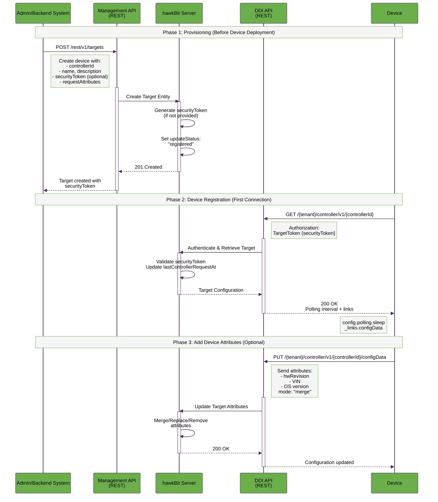
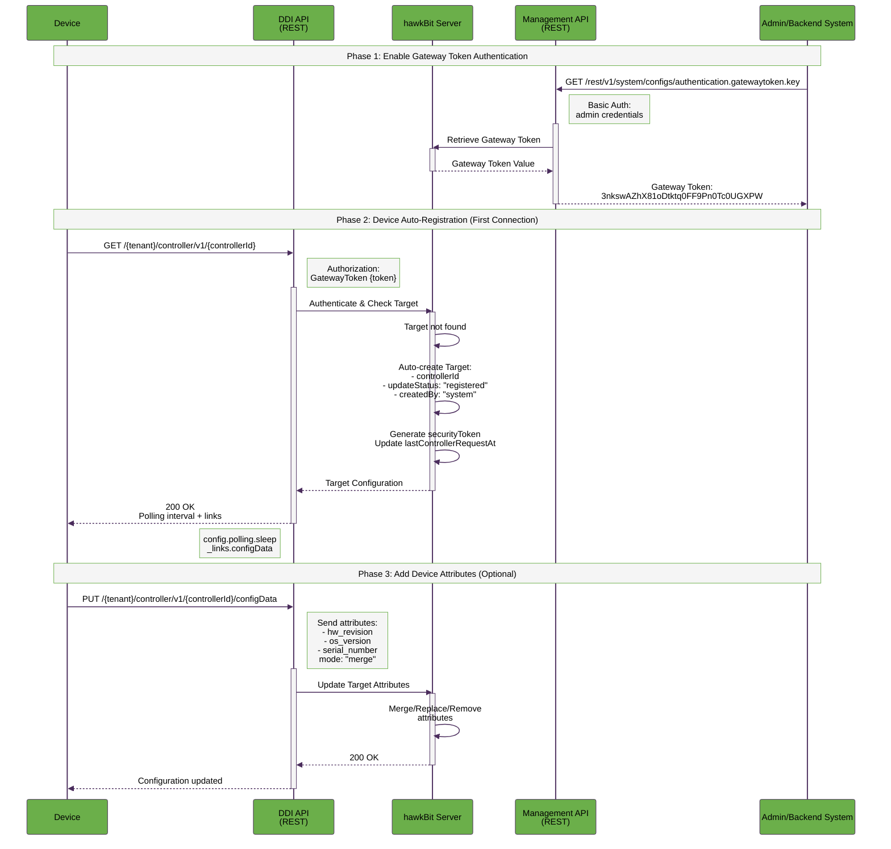

# Device Provisioning

Device provisioning is the process of registering a device with the hawkBit update server so it can receive software updates. hawkBit supports two main provisioning scenarios:
- **Provisioning and Registration via Management API**: An administrator or backend system register devices in hawkBit before they connect by providing device identification and description. This approach provides centralized control and is ideal for pre-planned deployments.
- **Direct Registration via DDI API**: Devices register themselves automatically when they first connect to hawkBit. This is called auto-registration and is ideal for dynamic environments.

## Provisioning and Registration via Management API

In this scenario, an administrator or backend system first provision the device using the Management UI or the [Management API](management-api.md). This is the step where the device identification and description is provided.

### When to Use

- Devices are provisioned during manufacturing or warehouse setup
- You need to assign software updates before devices are deployed
- You require strict inventory control
- You want to pre-configure security tokens
- Bulk provisioning of many devices

### Prerequisites

- Management API access with appropriate permissions:
  - `CREATE_TARGET` - to create targets
  - `UPDATE_TARGET` - to modify targets
  - `READ_TARGET` - to view targets
- Valid credentials (username/password) for Basic Authentication
- Target Security Token authentication enabled on the server - see [Configuration Properties](#configuration-properties) below

### Workflow

### Provisioning

**Endpoint:** 
```
POST /rest/v1/targets
```

**Request Headers:**
```http
Content-Type: application/json
Authorization: Basic <base64-encoded-credentials>
```

**Request Body:**
```json
[
  {
    "controllerId": "device-12345",
    "name": "Production Device 12345",
    "description": "Temperature sensor - Building A",
    "address": "https://192.168.1.100",
    "securityToken": "myCustomToken123456",
    "requestAttributes": true,
    "targetType": 1
  }
]
```
See [Target Entity Definition](entity-definitions.md#target) for all available fields.

**Response:**  201 Created
```json
[
  {
    "createdBy": "admin",
    "createdAt": 1709212800000,
    "lastModifiedBy": "admin",
    "lastModifiedAt": 1709212800000,
    "controllerId": "device-12345",
    "name": "Production Device 12345",
    "description": "Temperature sensor - Building A",
    "updateStatus": "registered",
    "securityToken": "mySecureToken987654321",
    "address": "https://192.168.1.100",
    "lastControllerRequestAt": 0,
    "installedAt": 0,
    "_links": {
      "self": {
        "href": "http://localhost:8080/rest/v1/targets/device-12345"
      },
      "assignedDS": {
        "href": "http://localhost:8080/rest/v1/targets/device-12345/assignedDS"
      },
      "installedDS": {
        "href": "http://localhost:8080/rest/v1/targets/device-12345/installedDS"
      },
      "attributes": {
        "href": "http://localhost:8080/rest/v1/targets/device-12345/attributes"
      },
      "actions": {
        "href": "http://localhost:8080/rest/v1/targets/device-12345/actions"
      }
    }
  }
]
```

### Registration
To complete the whole process, the provisioned device can register itself via the [Direct Device Integration API](direct-device-integration-api.md) using its `controllerId` and `securityToken`.

**Endpoint:** 
```
GET /{tenant}/controller/v1/{controllerId}
```

**Request Headers:**
```http
Authorization: TargetToken mySecureToken987654321
```

**Response:** 200 OK
```json
{
  "config": {
    "polling": {
      "sleep": "00:05:00"
    }
  },
  "_links": {
    "configData": {
      "href": "http://localhost:8080/DEFAULT/controller/v1/device-12345/configData"
    }
  }
}
```

### Add Device Attributes (Optional)

By following the link to `configData` provided in response to the last call, you can add some attributes to the device. In the code example below, we have shown how to add two attributes, namely hwRevision and VIN.

**Endpoint:** `PUT {tenant}/controller/v1/{controllerId}/configData`

**Authentication:** TargetToken

**Request Headers:**
```http
Content-Type: application/json
Authorization: TargetToken mySecureToken987654321
```

**Request Body:**
```json
{
  "mode": "merge",
  "data": {
    "hwRevision": "2",
    "VIN": "JH4TB2H26CC000000"
  }
}
```

**Response:**  200 OK
```json
```

### Best Practices

1. **Security Tokens**: Generate strong, unique tokens for each device (at least 32 characters)
2. **Bulk Creation**: Use array notation to create multiple targets in a single request
3. **Target Types**: Use target types to categorize devices (e.g., by hardware model)
4. **Naming Convention**: Use consistent, meaningful naming for `controllerId` (e.g., serial numbers)
5. **Pre-assignment**: Assign distribution sets before devices go online for immediate updates

---

## Direct Registration via Direct Device Integration API

In this scenario, devices register themselves automatically when they first connect to hawkBit. This is called **auto-registration** and is ideal for dynamic environments.

### When to Use
- Devices are manufactured without pre-registration
- You have a dynamic fleet with frequent additions
- Gateway devices manage multiple sub-devices
- You prefer decentralized, self-service provisioning
- IoT scenarios with thousands of devices

### Prerequisites
- Gateway Token authentication enabled on the server:
  - Target Security Token mode (per-device tokens), OR
  - Gateway Token mode (single token for all devices in a tenant), OR
  - Certificate-based authentication (mTLS)
- Device must know its `controllerId` (typically MAC address, serial number, or UUID)

see [Configuration Properties](#configuration-properties) below for details on how to enable authentication modes.

### Workflow


### Enable Gateway Token Authentication

All devices share a single token for the tenant. **Use with caution in production.**

**Enable in system configuration:**
```properties
hawkbit.server.ddi.security.authentication.gatewaytoken.enabled=true
```

**Enable in tenant configuration:**
```
authentication.gatewaytoken.enabled=true
```

**Retrieve Gateway Token:**
```bash
curl http://localhost:8080/rest/v1/system/configs/authentication.gatewaytoken.key \
  -u admin:admin
```

**Response:**
```json
{
  "value": "3nkswAZhX81oDtktq0FF9Pn0Tc0UGXPW",
  "global": false,
  "lastModifiedAt": 1770794878411,
  "lastModifiedBy": "admin",
  "createdAt": 1770794562205,
  "createdBy": "admin",
  "_links": {
    "self": {
      "href": "http://localhost:8080/rest/v1/system/configs/authentication.gatewaytoken.key"
    }
  }
}
```

### Device Auto-Registration on First Poll

The device polls the hawkBit server using its `controllerId`. If the target doesn't exist, hawkBit creates it automatically.

**Endpoint:** 
```
GET /{tenant}/controller/v1/{controllerId}
```
**Authentication:** GatewayToken

**Request Headers:**
```http
Authorization: GatewayToken 3nkswAZhX81oDtktq0FF9Pn0Tc0UGXPW
```

**Response:**  200 OK
```json
{
  "config": {
    "polling": {
      "sleep": "00:05:00"
    }
  },
  "_links": {
    "configData": {
      "href": "http://localhost:8080/DEFAULT/controller/v1/device-abc-001/configData"
    }
  }
}
```

### Add Device Attributes (Optional)

The device can send its attributes (hardware version, OS version, custom data) to hawkBit.

**Endpoint:** `PUT {tenant}/controller/v1/{controllerId}/configData`

**Authentication:** GatewayToken

**Request Headers:**
```http
Content-Type: application/json
Authorization: GatewayToken mySecureToken987654321
```

**Request Body:**
```json
{
  "mode": "merge",
  "data": {
    "hw_revision": "1.2",
    "os_version": "Linux 5.10.0",
    "serial_number": "SN123456789",
    "mac_address": "00:1A:2B:3C:4D:5E"
  }
}
```
**Modes:**
- `merge`: Merge new attributes with existing ones
- `replace`: Replace all attributes with new data
- `remove`: Remove specified attributes

**Response:**  200 OK
```json
```

### Best Practices

1. **Authentication**: Use Target Security Tokens or certificates in production; Gateway Tokens only for development
2. **Polling Interval**: Respect the server-provided polling interval to avoid overloading the server
3. **Attributes**: Send detailed device attributes to enable filtering and reporting
4. **Controller ID**: Use persistent, unique identifiers (MAC address, serial number, UUID)
5. **Feedback**: Always send feedback after updates (success/failure) for audit trails
6. **Error Handling**: Implement exponential backoff on connection failures

---

## Comparison: Management API vs DDI API

| Aspect | Management API Provisioning | DDI Auto-Registration |
|--------|----------------------------|----------------------|
| **Timing** | Before device deployment | On first device connection |
| **Control** | Centralized by admin | Decentralized (device-initiated) |
| **Use Case** | Pre-planned deployments | Dynamic fleet management |
| **Authentication** | Basic Auth (admin credentials) | TargetToken / GatewayToken / mTLS |
| **Security Token** | Set during creation or auto-generated | Auto-generated on registration |
| **Pre-assignment** | Possible before device connects | Only after first poll |
| **Scalability** | Manual or scripted bulk creation | Automatic, scales infinitely |
| **Device Attributes** | Must be set via separate request | Device sends on first connection |
| **Audit Trail** | `createdBy: admin` | `createdBy: system` |

---

## Security Considerations

### Management API

1. **Access Control**: Restrict Management API access using role-based permissions
2. **Credentials**: Use strong passwords and consider API keys for automated systems
3. **HTTPS**: Always use HTTPS in production to protect credentials
4. **Token Generation**: Generate cryptographically random security tokens (32+ characters)
5. **Least Privilege**: Grant only necessary permissions (e.g., `CREATE_TARGET` for provisioning systems)

### DDI API

1. **Gateway Token**: Never use in production for large deployments; prefer per-device tokens
2. **Token Storage**: Devices should securely store their security tokens (TPM, secure element)
3. **Certificate Auth**: Use mTLS for maximum security in IoT deployments
4. **Token Rotation**: Consider implementing token rotation mechanisms
5. **Auto-Registration**: Disable auto-registration in highly secure environments; use Management API only

---

## Configuration Properties

### Enable DDI Authentication Modes

**System-wide (application.properties):**
```properties
# Target Security Token (per-device)
hawkbit.server.ddi.security.authentication.targettoken.enabled=true

# Gateway Token (shared token)
hawkbit.server.ddi.security.authentication.gatewaytoken.enabled=true

# Anonymous downloads (not recommended for production)
hawkbit.server.ddi.security.authentication.anonymous.enabled=false
```
---
## Related Documentation

- [Management API](management-api.md) - Complete Management API reference
- [Direct Device Integration API](direct-device-integration-api.md) - Complete DDI API reference
- [Authentication](authentication.md) - Detailed authentication mechanisms
- [Authorization](authorization.md) - Role-based access control
- [Entity Definitions](entity-definitions.md) - Data models and schemas

---